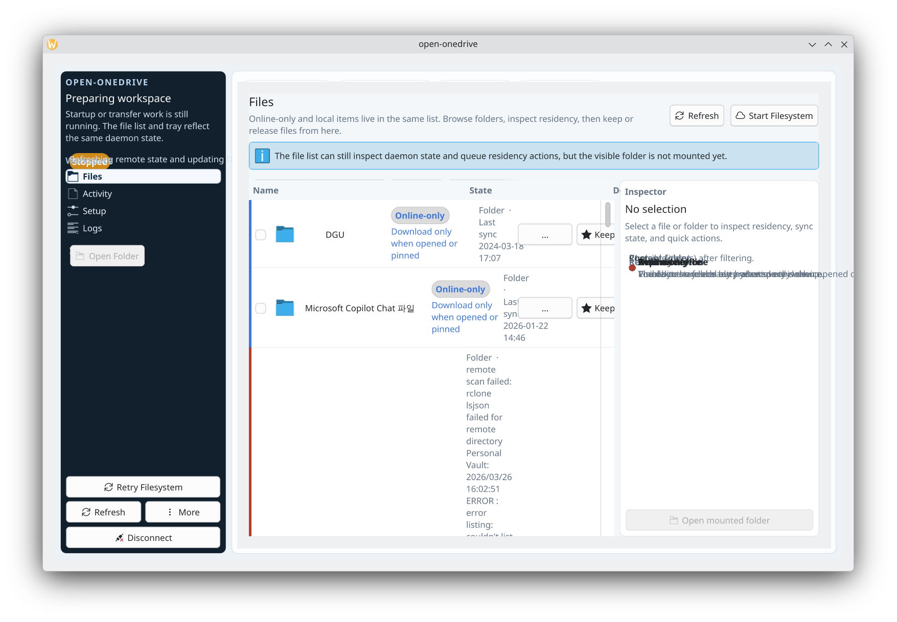

<p align="center">
  
</p>

<h1 align="center">open-onedrive</h1>

<p align="center">
  <strong>OneDrive를 Linux의 평범한 폴더처럼.</strong><br/>
  online-only 파일 가시성, on-demand hydrate, 파일 단위 residency 제어, 단순한 대시보드와 설정 화면, 그리고 앱·트레이·CLI·Dolphin·Nautilus가 공유하는 하나의 daemon 상태를 제공합니다.
</p>

<p align="center">
  <a href="./README.md">English</a> ·
  <a href="#주요-특징">주요 특징</a> ·
  <a href="#빠른-시작">빠른 시작</a> ·
  <a href="#일상-사용">일상 사용</a> ·
  <a href="#동작-방식">동작 방식</a> ·
  <a href="#개발">개발</a>
</p>

<p align="center">
  
</p>

<p align="center">
  <a href="https://kde.org/plasma-desktop/"></a>
  <a href="https://www.rust-lang.org/"></a>
  <a href="https://www.qt.io/"></a>
  <a href="https://github.com/smturtle2/open-onedrive/actions/workflows/ci.yml"></a>
  <a href="https://github.com/smturtle2/open-onedrive/actions/workflows/release.yml"></a>
  <a href="./LICENSE"></a>
</p>

> 안정판은 `Linux x86_64`를 대상으로 하며, 보이는 OneDrive 루트는 커스텀 FUSE 파일시스템으로 제공합니다. `rclone mount`는 사용하지 않습니다.

## 개요

`open-onedrive`는 `~/OneDrive` 같은 보이는 폴더를 만들고, hydrate 전에도 online-only 항목을 계속 보이게 유지합니다.

역할 분리는 다음과 같습니다.

- `rclone`은 인증, 원격 목록, 업로드/다운로드 primitive만 담당합니다
- `openonedrived`는 커스텀 동기화 모델, metadata cache, on-demand hydrate, queue, retry 흐름, path state를 직접 소유합니다
- Qt 셸, 분리된 tray helper, CLI, Dolphin 플러그인, Nautilus extension은 모두 같은 daemon 상태를 읽습니다

즉, 일반 Linux 앱에는 평범한 폴더처럼 보이고, `Keep on this device`와 `Free up space` 제어는 wrapper가 직접 책임집니다.

## 주요 특징

- 커스텀 FUSE 루트를 통해 online-only 파일과 폴더를 계속 가시화
- `rclone mount`가 아니라 daemon이 관리하는 on-demand 다운로드와 queued 업로드
- 앱, tray, CLI, Dolphin, Nautilus에서 파일/폴더 단위 residency 제어
- `online-only`, `local`, `pinned`, `syncing`, `attention` 상태를 구분하는 Dolphin overlay와 우클릭 액션
- 복잡한 운영 콘솔 대신 단순한 Dashboard와 Settings 화면
- 창을 닫아도 백그라운드 제어가 남는 독립 tray helper
- `~/.config/rclone/rclone.conf`와 분리된 app-owned `rclone.conf`
- checksum 검증, 기존 설치 업그레이드 확인, `rclone` 자동 설치를 포함한 one-line installer

## 빠른 시작

최신 안정판 설치:

```bash
curl -fsSL https://raw.githubusercontent.com/smturtle2/open-onedrive/main/install.sh | bash
```

특정 tag 고정 설치:

```bash
curl -fsSL https://raw.githubusercontent.com/smturtle2/open-onedrive/YOUR_TAG/install.sh | bash
```

같은 bootstrap 경로로 source 빌드:

```bash
curl -fsSL https://raw.githubusercontent.com/smturtle2/open-onedrive/main/install.sh | env OPEN_ONEDRIVE_BUILD_FROM_SOURCE=1 bash
```

자동화 환경에서 interactive 업그레이드 프롬프트 생략:

```bash
curl -fsSL https://raw.githubusercontent.com/smturtle2/open-onedrive/main/install.sh | env OPEN_ONEDRIVE_ASSUME_YES=1 bash
```

release installer는 다음을 수행합니다.

- Linux release archive와 SHA256 파일 다운로드
- 기존 설치를 감지하고 interactive 업그레이드 또는 재설치 여부 확인
- `rclone`이 없으면 자동 설치 시도
- daemon, UI, tray helper, icon, launcher, user service, Dolphin 통합, Nautilus extension을 `~/.local` 아래 설치
- `OPEN_ONEDRIVE_ASSUME_YES=1` 없이 non-interactive 환경에서 기존 설치를 덮어쓰지 않음

실행과 확인:

```bash
open-onedrive
systemctl --user status openonedrived.service
openonedrivectl status
```

## 일상 사용

첫 실행 순서:

1. `Settings`에서 `~/OneDrive` 같은 빈 보이는 폴더를 고릅니다.
2. `rclone`이 시작한 Microsoft 브라우저 로그인 과정을 끝냅니다.
3. 파일시스템이 아직 멈춰 있으면 `Dashboard`의 기본 작업으로 시작합니다.
4. `Files`에서 online-only와 local 항목을 함께 확인합니다.
5. 앱, tray, Dolphin, Nautilus, CLI에서 `Keep on this device` 또는 `Free up space`를 사용합니다.

주요 화면:

- `Dashboard`: 상태, 큐, 저장소 사용량, 다음 권장 작업만 짧게 요약
- `Files`: online-only 가시성과 residency 변경을 처리하는 메인 작업 화면
- `Settings`: 폴더 경로, 연결, 복구, disconnect
- `Logs`: daemon과 `rclone`의 최근 출력 확인
- `Tray`: 창이 닫힌 뒤에도 남는 분리된 helper

CLI 예시:

```bash
openonedrivectl set-root-path ~/OneDrive
openonedrivectl start-filesystem
openonedrivectl keep-local ~/OneDrive/Documents/report.pdf
openonedrivectl make-online-only ~/OneDrive/Documents/report.pdf
openonedrivectl retry-transfer ~/OneDrive/Documents/report.pdf
openonedrivectl list-directory Docs
openonedrivectl refresh-directory Docs
openonedrivectl search-paths report --limit 20
openonedrivectl path-states ~/OneDrive/Documents/report.pdf
```

프로젝트 상태는 보통 다음 XDG 경로 아래에 저장됩니다.

- `~/.config/open-onedrive/config.toml`
- `~/.config/open-onedrive/rclone/rclone.conf`
- `~/.local/share/open-onedrive/install-metadata.env`
- `~/.local/state/open-onedrive/runtime-state.toml`
- `~/.local/state/open-onedrive/path-state.sqlite3`

## 지원 범위

| 영역 | 상태 |
| --- | --- |
| OS / 아키텍처 | Linux `x86_64` |
| 보이는 루트 | `openonedrived`가 관리하는 커스텀 FUSE 경로 |
| OneDrive backend | `rclone` 인증, 목록, 업로드, 다운로드 primitive |
| native 파일 관리자 통합 | `Dolphin` 우선, `Nautilus` 보조 |
| UI 표면 | Qt 셸 + 분리된 tray helper |
| 안정판 설치 대상 | `~/.local` 사용자 로컬 설치 |

현재 비목표:

- `rclone mount`
- `Dolphin` / `Nautilus`를 넘는 native 통합
- Windows Cloud Files 수준의 placeholder parity
- custom Microsoft OAuth stack
- 자동 cache eviction

## 동작 방식

- daemon이 하나의 직렬 action queue를 소유해 `rclone` 작업이 UI 프로세스와 분리됩니다
- background sync가 pause된 상태에서도 foreground hydrate, keep, free-space 작업은 계속 처리합니다
- `rclone lsjson --hash`가 파일 바이트를 hydrate하지 않고 원격 metadata를 갱신합니다
- `rclone copyto`가 첫 open에서 cold file을 다운로드하고 dirty local write를 업로드합니다
- path state가 저장돼 shell, tray, CLI, 파일 관리자 통합에서 online-only / local / conflict / error 상태를 함께 봅니다
- hydrate된 바이트는 보이는 루트 안의 숨김 backing 디렉터리에 저장되고, visible tree는 깔끔하게 유지됩니다

## 개발

일상 명령:

```bash
./scripts/dev.sh bootstrap
./scripts/dev.sh up
./scripts/dev.sh status
./scripts/dev.sh test
```

워크스페이스 작업:

```bash
cargo run -p xtask -- check
cargo run -p xtask -- build-ui
cargo run -p xtask -- build-integrations
cargo run -p xtask -- install
```

## 트러블슈팅

- `Daemon not reachable on D-Bus`: `open-onedrive`를 한 번 실행하거나 `systemctl --user status openonedrived.service`를 확인합니다.
- 파일시스템 시작 실패: `/dev/fuse`와 `fusermount3` 또는 `mount.fuse3` 존재 여부를 확인합니다.
- Dolphin action/overlay가 보이지 않음: `kbuildsycoca6` 실행 후 Dolphin을 재시작하고 `~/.local/lib/qt6/plugins/kf6/` 아래 플러그인을 확인합니다.
- Nautilus action/emblem이 보이지 않음: `nautilus-python` 설치 여부를 확인한 뒤 Nautilus를 재시작합니다. 안정판 기준 우선 통합 대상은 Dolphin입니다.
- sync가 paused 또는 degraded 상태: on-demand open은 계속 동작하지만 dirty write는 resume 전까지 큐에 남습니다.

## License

MIT. 자세한 내용은 [LICENSE](./LICENSE)를 참고하세요.
