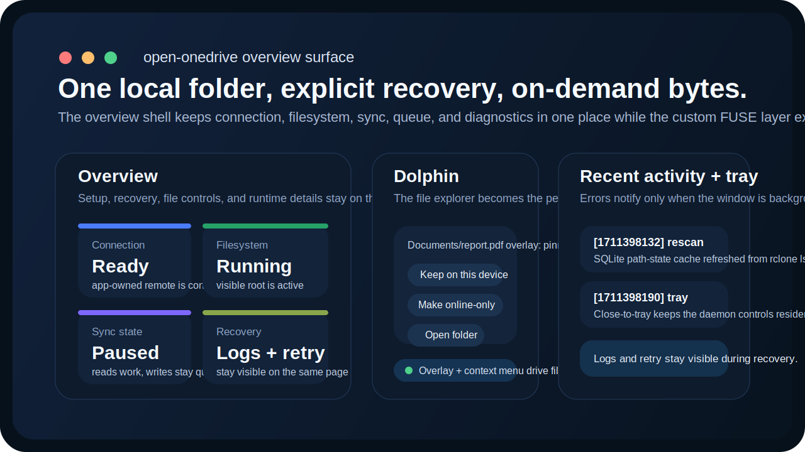
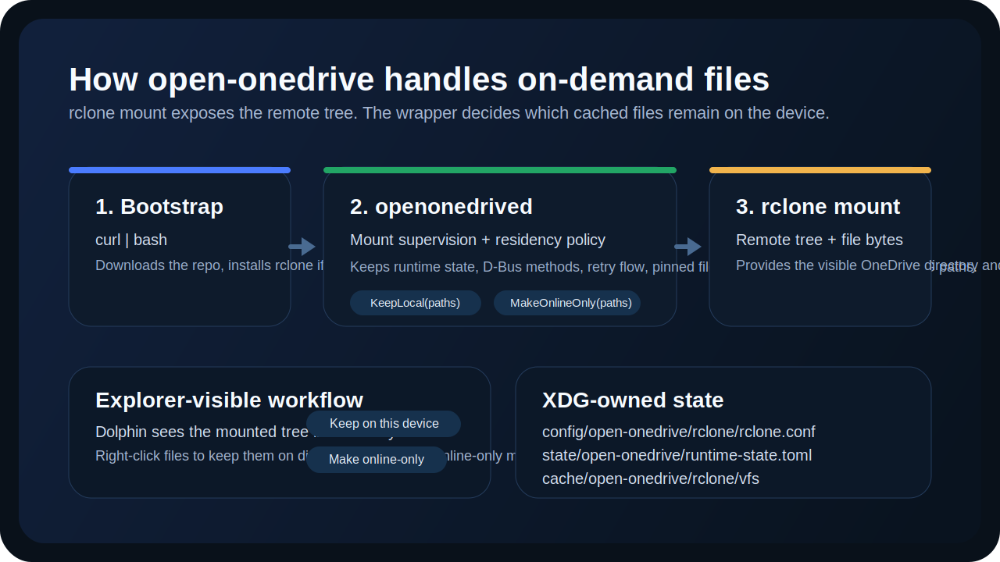

<p align="center">
  
</p>

<h1 align="center">open-onedrive</h1>

<p align="center">
  일반 로컬 폴더처럼 보이는 OneDrive 루트, 투명한 on-demand hydrate, 파일별 장치 유지 또는 online-only 전환, Dolphin 오버레이, tray/dashboard 셸을 제공하는 KDE 중심 Linux OneDrive 클라이언트입니다.
</p>

<p align="center">
  <a href="https://kde.org/plasma-desktop/"></a>
  <a href="https://www.rust-lang.org/"></a>
  <a href="https://www.qt.io/"></a>
  <a href="https://github.com/smturtle2/open-onedrive/actions/workflows/ci.yml"></a>
  <a href="https://github.com/smturtle2/open-onedrive/actions/workflows/release.yml"></a>
  <a href="./LICENSE"></a>
</p>

<p align="center">
  <a href="./README.md">English</a> ·
  <a href="#주요-특징">주요 특징</a> ·
  <a href="#빠른-시작">빠른 시작</a> ·
  <a href="#설정">설정</a> ·
  <a href="#동작-방식">동작 방식</a> ·
  <a href="#개발">개발</a>
</p>

<p align="center">
  
</p>

## 개요

`open-onedrive`는 Linux `KDE Plasma 6 + Dolphin`을 1차 타깃으로 하며, `~/OneDrive` 같은 일반 폴더에 커스텀 FUSE 파일시스템을 올려 OneDrive를 노출합니다.

`rclone mount`는 사용하지 않습니다.

대신:

- `rclone`은 원격 인증, 디렉터리 목록 조회, 파일 전송 primitive를 담당합니다
- daemon은 on-demand 파일시스템, 전송 큐, path-state cache, conflict, tray 상태, Dolphin 통합을 직접 소유합니다
- hydrate된 바이트는 기본적으로 `.openonedrive-cache`라는 숨김 backing 디렉터리에 저장됩니다

그래서 KDE 앱뿐 아니라 일반 Linux 앱도 평범한 로컬 경로처럼 사용할 수 있습니다.

## 주요 특징

- `~/OneDrive` 같은 보이는 루트 폴더를 제공하는 커스텀 FUSE 파일시스템
- KDE 앱 전용이 아니라 일반 Linux 앱에서도 동작하는 on-demand hydrate
- 파일별 `Keep on this device` / `Make online-only`
- `~/.config/rclone/rclone.conf`와 분리된 app-owned `rclone.conf`
- SQLite 기반 path-state cache와 업로드/다운로드 큐
- Dolphin overlay icon과 context action
- 파일시스템 상태, 전송 큐, conflict, 로그를 보여주는 Qt6/Kirigami dashboard
- release 우선 `curl ... | bash` 설치 경로

## 빠른 시작

최신 release 설치:

```bash
curl -fsSL https://raw.githubusercontent.com/smturtle2/open-onedrive/main/install.sh | bash
```

특정 tag 설치:

```bash
curl -fsSL https://raw.githubusercontent.com/smturtle2/open-onedrive/main/install.sh | env OPEN_ONEDRIVE_REF=v0.1.0 bash
```

소스 빌드 bootstrap 강제:

```bash
curl -fsSL https://raw.githubusercontent.com/smturtle2/open-onedrive/main/install.sh | env OPEN_ONEDRIVE_BUILD_FROM_SOURCE=1 bash
```

release installer가 하는 일:

- Linux `x86_64` release archive와 SHA256 파일 다운로드
- archive 검증 후 압축 해제
- 바이너리, KDE plugin, icon, launcher, user service를 홈 디렉터리에 설치
- `rclone`이 없으면 자동 설치 시도
- FUSE 3 런타임이 없으면 경고 출력
- `systemd --user`가 있으면 `openonedrived.service` 활성화

실행과 확인:

```bash
open-onedrive
systemctl --user status openonedrived.service
openonedrivectl status
```

첫 실행 흐름:

1. `~/OneDrive` 같은 루트 폴더를 고릅니다.
2. `rclone`이 시작한 Microsoft 브라우저 로그인 과정을 끝냅니다.
3. 필요하면 앱에서 파일시스템을 시작합니다.
4. Dolphin, 터미널, LibreOffice, VS Code 같은 일반 앱에서 루트 폴더를 엽니다.
5. dashboard, tray, CLI, Dolphin action으로 파일을 로컬 유지하거나 다시 online-only로 전환합니다.

CLI 예시:

```bash
openonedrivectl set-root-path ~/OneDrive
openonedrivectl start-filesystem
openonedrivectl keep-local ~/OneDrive/Documents/report.pdf
openonedrivectl make-online-only ~/OneDrive/Documents/report.pdf
openonedrivectl retry-transfer ~/OneDrive/Documents/report.pdf
openonedrivectl path-states ~/OneDrive/Documents/report.pdf
```

## 요구 사항

- Linux `x86_64`
- `rclone`
- `/dev/fuse`가 포함된 FUSE 3 런타임
- 1차 타깃: `KDE Plasma 6` + `Dolphin`
- release installer 기준 사용자 로컬 설치 경로: `~/.local`
- source build 경로: Rust, CMake, Qt6 tooling, KF6 development package, fuse3 development package, C++ compiler

## 설정

앱은 보통 다음 XDG 경로를 사용합니다:

- `~/.config/open-onedrive/config.toml`
- `~/.config/open-onedrive/rclone/rclone.conf`
- `~/.local/state/open-onedrive/runtime-state.toml`
- `~/.local/state/open-onedrive/path-state.sqlite3`

예시 `config.toml`:

```toml
root_path = "/home/you/OneDrive"
remote_name = "openonedrive"
cache_limit_gb = 10
auto_start_filesystem = true
backing_dir_name = ".openonedrive-cache"

# Optional overrides
# rclone_bin = "/usr/bin/rclone"
# custom_client_id = "your-microsoft-client-id"
```

보장 사항:

- wrapper는 `~/.config/rclone/rclone.conf`를 절대 수정하지 않습니다
- 보이는 루트 폴더는 일반 앱 접근용입니다
- hydrate된 바이트는 숨김 backing 디렉터리에 저장됩니다
- dashboard, tray, CLI, Dolphin 통합은 모두 같은 daemon 상태를 공유합니다
- 숨김 backing 디렉터리는 구현 디테일이므로 직접 수정하면 안 됩니다

## UI 메모

- Setup 화면은 보이는 루트 폴더 선택과 브라우저 인증 시작에 집중합니다.
- Dashboard는 connection 상태, filesystem 상태, sync 상태, pending transfer, conflict, backing storage 사용량, pinned file 수, 최근 진단 로그를 보여줍니다.
- Tray는 filesystem, transfer, error 상태를 반영하고 창을 닫아도 앱을 상주시킵니다.
- Dolphin overlay와 action은 숨김 backing 디렉터리를 무시하고 보이는 루트 경로만 다룹니다.

## 동작 방식

<p align="center">
  
</p>

- `openonedrived`가 runtime state, D-Bus method, 커스텀 FUSE 파일시스템, queue, conflict, residency policy를 소유합니다
- 보이는 루트 폴더는 daemon이 직접 mount하며 `rclone mount`를 쓰지 않습니다
- `rclone lsjson`이 원격 메타데이터를 갱신합니다
- `rclone copyto`가 필요할 때 다운로드와 업로드를 수행합니다
- 숨김 backing 디렉터리가 hydrate 또는 pinned 바이트를 유지합니다
- Dolphin overlay plugin은 daemon 상태를 비동기로 조회하고 signal로 자체 캐시를 무효화합니다

## 프로젝트 구성

| Path | 역할 |
| --- | --- |
| `install.sh` | release 우선 `curl ... | bash` 진입점 |
| `scripts/install.sh` | 개발자용 source install 경로 |
| `crates/openonedrived` | daemon 진입점과 D-Bus 표면 |
| `crates/openonedrivectl` | 제어, 상태, rescan, path-state 조회용 CLI |
| `crates/rclone-backend` | 커스텀 FUSE sync engine, transfer queue, path-state cache, 로그, `rclone` primitive |
| `crates/config` | XDG 경로, 앱 설정, 보이는 루트 경로 검증 |
| `crates/ipc-types` | 공용 D-Bus 상태 및 path-state 타입 |
| `crates/state` | 가벼운 runtime state 영속화 |
| `ui/` | Qt6/Kirigami 셸과 KDE tray 통합 |
| `integrations/` | Dolphin file action과 overlay plugin |
| `xtask/` | 개발자용 source build 자동화 |

## 비목표

- `rclone mount`
- KIO 전용 탐색 모델
- Windows Cloud Files 수준의 placeholder parity
- 이번 릴리스에서 GNOME/Nautilus 지원
- custom Microsoft OAuth stack

## 개발

일상적인 repo 명령:

```bash
./scripts/dev.sh bootstrap
./scripts/dev.sh up
./scripts/dev.sh status
./scripts/dev.sh test
```

workspace 작업:

```bash
cargo run -p xtask -- check
cargo run -p xtask -- build-ui
cargo run -p xtask -- build-integrations
cargo run -p xtask -- install
```

## 라이선스

MIT. 자세한 내용은 [LICENSE](./LICENSE).
